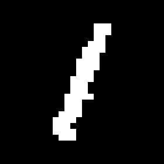
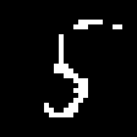
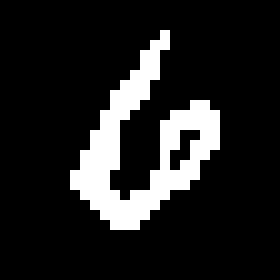

# ARDM
MVA Generative Models project on [Order Agnostic Autoregressive Diffusion Models](https://github.com/google-research/google-research/tree/master/autoregressive_diffusion).

## Face generation ([CelebA](https://mmlab.ie.cuhk.edu.hk/projects/CelebA.html))

    

## Character Generation ([binary MNIST](https://github.com/aiddun/binary-mnist))

    

## Source code

- Run `MNIST.ipynb` to train and evaluate a UNet model on the binary MNIST dataset
- Run `TinyCelebA.ipynb` to train and evaluate a UNet model on the Tiny CelebA dataset (we use 60×73 images with 32 grey-levels)
- Run `TuringTest.ipynb` to compare generated images with images from the dataset

## Code reuse 

We used parts from [UNet](https://github.com/zhixuhao/unet), [oardm](https://github.com/DuaneNielsen/oardm) and [pytorch-fid](https://github.com/mseitzer/pytorch-fid)
